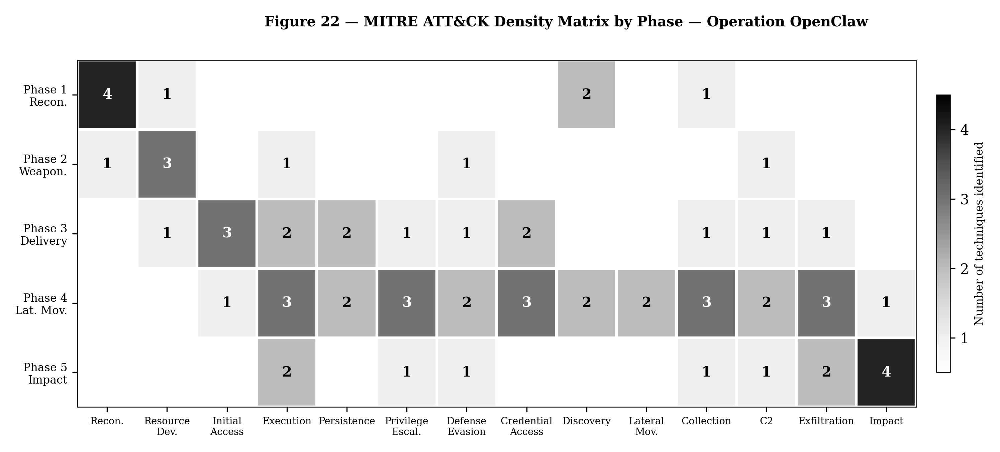

# Operação OpenClaw: Modelagem de uma Kill Chain Baseada em Agente contra Infraestrutura Corporativa

**Fabrice Pizzi** — Université Paris Sorbonne, 2026

*Nota Resumo Acadêmica — Fevereiro 2026*

---

## Resumo

Este documento apresenta um modelo de ameaça abrangente de um ataque cibernético em múltiplas fases que explora um agente de codificação de IA autônomo (OpenClaw) tanto como vetor de ataque quanto como multiplicador de força contra uma empresa farmacêutica fictícia (PharmEurys SA, ~500 funcionários). A análise cobre uma kill chain completa abrangendo 36 dias (D−30 a D+6), desde reconhecimento OSINT ampliado por LLM, passando pelo comprometimento da cadeia de suprimentos e movimento lateral via personificação de agente de IA, até a implantação de ransomware e dupla extorsão. Todas as técnicas, vulnerabilidades e ferramentas descritas estão documentadas na literatura pública a partir de fevereiro de 2026.

O estudo identifica que 13 das 14 táticas do MITRE ATT&CK Enterprise são cobertas ao longo das cinco fases, sendo a Fase 4 (movimento lateral) aquela que apresenta a maior densidade de técnicas. Um modelo de defesa em profundidade de cinco camadas específico para ameaças de IA baseadas em agentes é proposto, demonstrando que controles fundamentais (gestão de patches, MFA, segmentação de rede, backups imutáveis) teriam interrompido a maior parte da kill chain, enquanto controles específicos de IA (listas de permissão de ferramentas, sandboxing, monitoramento de saída) fornecem proteção complementar, mas não substitutiva.

**Palavras-chave**: Segurança de agentes de IA, kill chain baseada em agente, injeção de prompt, comprometimento de cadeia de suprimentos, OpenClaw, ransomware, defesa em profundidade, MITRE ATT&CK

---

## 1. Introdução e Motivação

O surgimento de agentes de IA autônomos — capazes de executar comandos, acessar arquivos, comunicar-se via APIs e manter memória persistente — representa uma mudança qualitativa na superfície de ataque de sistemas de informação. O OpenClaw, um agente de codificação de código aberto implantado em mais de 40.000 instâncias expostas na Internet (SecurityScorecard, fevereiro de 2026), ilustra essa convergência de riscos: um agente que possui simultaneamente as três propriedades da *tríade letal* de Willison — acesso a dados privados, exposição a conteúdos não confiáveis e capacidade de comunicação externa — oferece uma superfície de exploração sem precedentes.

Este estudo modela uma operação ofensiva fictícia completa explorando essa convergência, com três objetivos:

1. **Demonstrar a viabilidade técnica** de uma kill chain ponta a ponta baseada em agentes, usando exclusivamente vulnerabilidades e técnicas documentadas publicamente.
2. **Mapear sistematicamente** táticas e técnicas de acordo com os frameworks MITRE ATT&CK Enterprise v15 e MITRE ATLAS.
3. **Propor um modelo defensivo estruturado** adaptado às ameaças específicas dos agentes de IA autônomos.

A organização alvo, PharmEurys SA, é uma entidade fictícia (PME farmacêutica, ~500 funcionários, infraestrutura padrão Microsoft) projetada para ser representativa de empresas europeias típicas de médio porte.

## 2. Metodologia

A análise segue o modelo Cyber Kill Chain da Lockheed Martin, estendido para incorporar as especificidades dos agentes de IA autônomos segundo a Promptware Kill Chain de C. Schneider (2026) e a taxonomia do Top 10 da OWASP para Aplicações Baseadas em Agentes 2026. Cada fase é documentada em um relatório detalhado separado (~25-30 páginas), referenciado como anexo a esta nota.

As fontes primárias incluem: publicações de fornecedores de segurança (Cisco, Sophos, CrowdStrike, Unit 42 da Palo Alto Networks), análises de vulnerabilidade (Hudson Rock, Snyk, Koi Security, Aikido), bancos de dados do MITRE ATT&CK/ATLAS, bem como documentação oficial do OpenClaw e da OWASP.

Nenhum ataque real foi conduzido. O cenário é totalmente fictício.

## 3. Descobertas por Fase

### 3.1 Fase 1 — Reconhecimento (D−30 → D−15)

O atacante aproveita as capacidades de inferência de um LLM não alinhado para ampliar o reconhecimento clássico via OSINT. Dados públicos do LinkedIn, metadados de serviços expostos (Shodan/Censys) e publicações científicas permitem a reconstrução completa do organograma da PharmEurys, identificação de pessoas-chave e mapeamento da infraestrutura técnica — incluindo instâncias expostas do OpenClaw com sua assinatura HTML característica.

**Descoberta principal**: O LLM permite a correlação e inferência de informações que a coleta manual tradicional não teria produzido no mesmo tempo, notadamente reconstruindo relacionamentos hierárquicos a partir de dados fragmentados.

### 3.2 Fase 2 — Armamento (D−15 → D−7)

O arsenal ofensivo compreende quatro componentes: (1) uma habilidade maliciosa ("skill") para o OpenClaw publicada no repositório da comunidade ClawHub, que combina injeção de prompt e exfiltração via curl para um servidor C2; (2) o ransomware PromptLock, compilado em Go com criptografia híbrida RSA-4096/AES-256-GCM; (3) payloads indiretos de injeção de prompt projetados para explorar os conectores do agente via Slack, e-mail e terminal; (4) um deepfake de áudio do diretor da empresa para cenários de engenharia social.

**Descoberta principal**: O mercado ClawHub apresenta barreiras mínimas de publicação. De 3.984 habilidades auditadas pela Snyk, 534 (13,4%) tinham problemas críticos e 76 continham payloads maliciosos confirmados. 91% das habilidades maliciosas combinaram injeção de prompt com malware tradicional.

### 3.3 Fase 3 — Entrega e Exploração (D−7 → D)

A entrega utiliza **três vetores simultâneos** para maximizar a probabilidade de acesso inicial: (1) a habilidade maliciosa instalada por um desenvolvedor via ClawHub; (2) um infostealer (variante do Vidar) exfiltrando arquivos de configuração do OpenClaw (~/.openclaw/), incluindo o token do gateway, chaves criptográficas e o arquivo de identidade comportamental soul.md — documentado pela Hudson Rock como um dos primeiros casos relatados publicamente de exfiltração direcionada a um agente de IA; (3) exploração da CVE-2024-55591 (CVSS 9.6) na VPN da Fortinet, com mais de 36.000 equipamentos comprometidos segundo a Arctic Wolf.

**Descoberta principal**: A redundância dos vetores de acesso (agente + rede + credenciais) exige correção e mitigação em cada superfície de forma independente — corrigir um único vetor não neutraliza os outros.

### 3.4 Fase 4 — Movimento Lateral (D → D+5)

A fase com a maior densidade técnica (13/14 táticas do ATT&CK cobertas). O invasor usa tokens roubados para criar um "agente fantasma" que herda a identidade e permissões do agente legítimo. A injeção de prompt via Slack sequestra o agente em uso para executar comandos de reconhecimento e movimentação lateral. A cadeia clássica de escalonamento no AD (Mimikatz → DCSync → Golden Ticket) é automatizada pelo agente comprometido. Paralelamente, o chatbot interno é envenenado por meio de substituição dos pesos do modelo (técnica de PoisonGPT/ROME).

**Descoberta principal**: A capacidade do agente comprometido de planejar e executar ações envolvendo várias etapas de modo autônomo e contínuo acelera substancialmente a progressão da kill chain, se comparada a um ataque humano operando de forma manual.

### 3.5 Fase 5 — Ações sobre Objetivos (D+5 → D+6)

De dá-se a exfiltração completa de dados de P&D (Pesquisa e Desenvolvimento), seguida pela implantação do ransomware PromptLock, que criptografa servidores de arquivos, desativa o Volume Shadow Copy Service e neutraliza backups previamente reconhecidos pelo ataque. O modelo de dupla extorsão baseia-se num resgate atrelado ao bloqueio dos sistemas somado à ameaça de publicação dos dados roubados. O resgate exigido é de €2,5M. O impacto financeiro completo, incluindo paralisações, forense e investigações legais, totaliza estimados €7,5M.

**Descoberta principal**: Organizações que canalizam quase a totalidade de seus orçamentos de segurança cibernética para mitigação primária (prevenção imediata de exfiltração final ou ransomware) têm uma taxa de recuperação menor se os arquivos e sistemas de backup primários não possuírem arquitetura imutável contra deleção e sobreescrita pelos próprios agentes administrativos do ambiente alvo (ou agentes shadow com permissões idênticas).  Nas ocorrências contemporâneas, 94% dos ransomwares visam primordialmente as infraestruturas de back-up (Dados da Sophos em 2025).

## 4. Cobertura MITRE ATT&CK — Análise Transversal das Fases

A matriz de densidade revela a progressão característica adotada nesta kill chain de cinco etapas. A Fase 1 aloca seus recursos fortemente na matriz de Reconhecimento, a Fase 2 no Desenvolvimento de Recursos, e a Fase 3 se espalha por oito táticas simultaneamente por utilizar vetores contíguos dissimilares e redundantes. A Fase 4 se distingue com treze das quatorze táticas cobertas simultaneamente (representando de fato o "coração da operação"). A Fase 5 refocaliza-se abruptamente na concretização de ações destrutivas (Impacto) combinadas à extração em massa.

O principal ponto revelado é que **a Fase 4 — e não a Fase 5 — constitui o real centro de gravidade da intrusão.** É durante esse lapso "mais silencioso" e prolixo tecnicamente, que o controle sobre o domínio é obtido e enraizado irreversivelmente pelo invasor. Como decorrência lógica, estratégias focadas unidimensionalmente no reconhecimento e alerta no momento da execução/disparo do ransomware (Fase 5), tenderão a demonstrar eficácia residual nula num contexto tão agravado.

*Figura 22 — Matriz de Densidade do MITRE ATT&CK por Fase (Original em Inglês)*

## 5. Modelo de Defesa em Profundidade

No intuito de estabelecer paradigmas resilientes de remediação, propõe-se um modelo estruturado escalonado em **cinco camadas**: (dispostas em faixas orientadas desde o próprio agente até a periferia imediata da rede e ambiente).

| Camada | Princípio Orientador | Controles Fundamentais |
|-------|------------------|-------------|
| **C1** — Governança do Agente | O LLM é um conselheiro, não atua despido de amarras | Verificação de permissões ("Allowlist") de ferramentas, Ambiente de execução em bolha ("sandbox"), interrupção condicional para aprovação humana (human-in-the-loop) e gestão qualificada das extensões/habilidades. |
| **C2** — Controle de Interações e  Input | Todo fluxo informativo externo deve ser intrinsecamente encarado corrompido, e reavaliado | Triagem severa, segmentação clara de plano de ação contra interpretação interpretada (separação dado-instrução explícita). Princípio de restrição mandatória para ingestão ("need to know"). |
| **C3** — Controle de Output/Saída | Intercâmbio de dados ou tráfego dissimulados mediante HTTPS autorizados rotineiramente | Uso de egress proxy sob contexto de serviço ou credencial singular de aplicação. Rotulagem estrita baseada na modelagem de Prevenção de Perda de Dados (DLP), e destino predeterminado em lista branca de conectividade . |
| **C4** — Mitigação e Decadência de Impactos | Um agente, perante o colapso, sob hipótese alguma espraia seus privilégios de acesso ao domínio ("Tenant" ou "AD SI") | Segmentação dura e rígida no plano do Data Center, contas de prestação isoladas, regras 3-2-1-1-0 completas, guias avançadas do controle do Diretório Ativo ou identidades hierárquicas |
| **C5** — Higiene Primária / Infraestrutura de base | Controles "de topo" de IA não sobrepõem os primados mandatórios habituais da proteção e endurecimento sistêmicos de T.I. Básica | Gestão agressiva, regular, programática e proativa do panorama de atualizações e "Patches", enraizamento do recurso aos dispositivos multi-fatores de Identidade (MFA robustos de chave). Extinção drástica e compulsória da visibilidade de ativos dispensáveis na fronteira (Internet aberta) para exposição residual. |

**Conclusão nuclear a extrair:** Contramedidas incrustadas em patamares densificados da rede como "C4" ou ainda orientadas ao zelo das instâncias computacionais primitivas alocadias como no "C5", representam — curiosamente, na era pós agentes sintéticos—, defesas dotadas do menor gradiente de custos cumulativa, contudo ostentando índice máximo absoluto do poder de corte antecipado perante a sucessão  desse kill chain analisado.

## 6. Discussões e Limitações

**Limitações metodológicas e contextuais deste experimento:** Este cenário ficcional supõe um autor, ator ou APT hostil dotado com alta propensão técnica, de alta intencionalidade, financiamento, com tempo hábil vasto e proficiência com a utilização pragmática e iterada de processamento em linguagem natural local  para alavancar os achados clássicos e convencionais de varreduras na web, e, subsequentemente munido à capacidade letal de explorar vulnerabilidades emergentes recém elucidadas, num período em que os alvos demoram reagir. O enquadramento de um Centro de Operações de Segurança (ou equivalente do "Blue Team" local) em absoluto silêncio com reações cegas aos eventos sucessivos transcorridos nas semanas que intermediam "D−15 a D+5", superdimensionam em contrapartida, intencionalmente nesta simulação — o montante destrutivo de perdas finais atingido contra a empresa alvo .

**Considerações em vista das Organizações:** Assumir o aporte, subscrição, internalização e implantação tecnológica maciça destas aplicações e recursos agentes em redes de produção em tempo presente da estrutura corporativa deve suscitar imediata análise dos impactos do que nomeamos a "Tríade de Willison". Agentes possuidores concomitantemente dos elementos "privação do fluxo autônomo total (emancipação)", "comportamento preditivo do LLM sobre as ferramentas do SO local das máquinas" aliados a um quadro permissivo onde esses atores consigam  acesso irrestrito direto ao coração confidencial dos repositórios nativos e também um passaporte para  discutir perante conectores da porta HTTP mundial afora ou de redes contíguas sem entraves deverão obrigatoriamente se ver despidos desse acúmulo temerário  em perfis superdotados de risco de alto nível no gerenciamento logarítmico corporativo atual .

## 7. Conclusão

Esta averiguação consubstancia a constatação que ferramentas cibernéticas munidas de raciocínios independentes dotadas de interfaces dinâmicas — ou meramente "Agentes Emancipados" da nova década — ultrapassam de largada o desafio puramente corriqueiro em que o mundo da CyberSec debatia-se num pretérito recente voltado exclusivamente aos mecanismos imutáveis sobre softwares legados que não dialogavam entre diferentes camadas . Tais entes  materializam , na verdade um redimensionamento brusco de natureza transversal perante quem defende, a cada dia os sistemas; afinal , quando controlada pela "Kill-Chain adversa", seu poder computacional de linguagem equipara-se à agilidade cognitiva, letalidade semântica a velocidades automatizadas. As organizações, neste preâmbulo imediato pós-generativo da revolução em curso, encontrar-se-ão compelidas primeiro , e imperativamente: a reidratarem os alicerces basilares sistêmicos adormecidos do ciberespaço original (A rede, o roteador , seus servidores remanescentes , a senha esquecida local, o processo de "update") através  de escrutínio de extrema precisão, só aí adentrando ao "modelo defensivo complexo atrelado unicamente às mitigações das linguagens sintéticas do universo IA .

 ---

*Versão em Inglês: [ACADEMIC_NOTE.md](ACADEMIC_NOTE.md)* | *Version Française : [NOTE_ACADEMIQUE.md](NOTE_ACADEMIQUE.md)*
