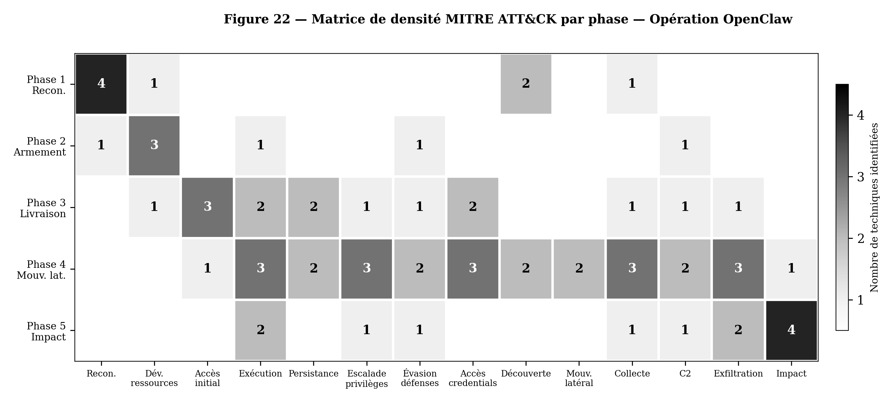

# Opération OpenClaw : Modélisation d'une Kill Chain Agentique Contre une Infrastructure d'Entreprise

**Fabrice Pizzi** — Université Paris Sorbonne, 2026

*Note de synthèse académique — Février 2026*

*🇬🇧 English version: [ACADEMIC_NOTE.md](ACADEMIC_NOTE.md)*

---

## Résumé

Ce travail présente la modélisation complète d'une cyberattaque multi-phases exploitant un agent IA de codage autonome (OpenClaw) comme vecteur d'attaque et multiplicateur de force contre une entreprise pharmaceutique fictive (MediFrance SA, ~500 employés). L'analyse couvre une kill chain complète de 36 jours (J−30 à J+6), depuis la reconnaissance OSINT augmentée par LLM jusqu'au déploiement d'un rançongiciel et à la double extorsion. L'ensemble des techniques, vulnérabilités et outils décrits sont documentés dans la littérature publique à février 2026.

L'étude identifie que 13 des 14 tactiques MITRE ATT&CK Enterprise sont couvertes sur les cinq phases, la Phase 4 (mouvement latéral) présentant la densité de techniques la plus élevée. Un modèle de défense en profondeur en cinq couches spécifique aux menaces agentiques est proposé, démontrant que les contrôles fondamentaux (patching, MFA, segmentation, sauvegardes immuables) auraient interrompu la majorité de la kill chain, tandis que les contrôles spécifiques à l'IA (allowlists d'outils, sandboxing, monitoring egress) offrent une protection complémentaire mais non substituable.

**Mots-clés** : sécurité des agents IA, kill chain agentique, injection de prompt, compromission supply chain, OpenClaw, rançongiciel, défense en profondeur, MITRE ATT&CK

---

## 1. Introduction et motivation

L'émergence des agents IA autonomes — capables d'exécuter des commandes, d'accéder à des fichiers, de communiquer via des API et de maintenir une mémoire persistante — représente un changement qualitatif dans la surface d'attaque des systèmes d'information. Le cas OpenClaw, agent de codage open source déployé sur plus de 40 000 instances exposées sur Internet (SecurityScorecard, février 2026), illustre cette convergence de risques : un agent qui réunit simultanément les trois propriétés de la *trifecta létale* de Willison — accès à des données privées, exposition à du contenu non fiable, et capacité de communication externe — offre une surface d'exploitation sans précédent pour un attaquant.

Ce travail modélise une opération offensive fictive complète exploitant cette convergence, avec trois objectifs :

1. **Démontrer la faisabilité technique** d'une kill chain agentique de bout en bout, en utilisant exclusivement des vulnérabilités et techniques documentées publiquement.
2. **Cartographier systématiquement** les tactiques et techniques sur les référentiels MITRE ATT&CK Enterprise v15 et MITRE ATLAS.
3. **Proposer un modèle défensif structuré** adapté aux menaces spécifiques des agents IA autonomes.

L'entreprise cible, MediFrance SA, est une entité fictive (PME pharmaceutique, ~500 employés, infrastructure Microsoft classique) conçue pour être représentative du tissu industriel européen.

## 2. Méthodologie

L'analyse suit le cadre de la Cyber Kill Chain de Lockheed Martin, étendu pour intégrer les spécificités des agents IA autonomes selon la Promptware Kill Chain de C. Schneider (2026) et la taxonomie OWASP Top 10 for Agentic Applications 2026. Chaque phase est documentée dans un rapport détaillé séparé (~25-30 pages), référencé comme annexe de la présente note.

Les sources primaires incluent : publications des éditeurs de sécurité (Cisco, Sophos, CrowdStrike, Palo Alto Networks Unit 42), analyses de vulnérabilités (Hudson Rock, Snyk, Koi Security, Aikido), bases MITRE ATT&CK/ATLAS, et documentation officielle OpenClaw et OWASP.

Aucune attaque réelle n'a été conduite. Le scénario est entièrement fictif.

## 3. Synthèse des findings par phase

### 3.1 Phase 1 — Reconnaissance (J−30 → J−15)

L'attaquant exploite les capacités d'inférence d'un LLM non aligné pour augmenter la reconnaissance OSINT classique. Les données publiques de LinkedIn, les métadonnées des services exposés (Shodan/Censys) et les publications scientifiques permettent de reconstituer l'organigramme complet de MediFrance, d'identifier les collaborateurs clés, et de cartographier l'infrastructure technique — incluant des instances OpenClaw exposées avec leur empreinte HTML caractéristique.

**Finding clé** : le LLM permet de corréler et d'inférer des informations que la collecte manuelle traditionnelle n'aurait pas produites dans le même délai, notamment la reconstitution des liens hiérarchiques à partir de données fragmentaires.

*Analyse détaillée : [Phase 1 — Reconnaissance](phases/Phase1_Reconnaissance.pdf)*

### 3.2 Phase 2 — Armement (J−15 → J−7)

L'arsenal offensif comprend quatre composantes : (1) une skill OpenClaw piégée publiée sur le registre communautaire ClawHub, combinant prompt injection et exfiltration via curl vers un C2 ; (2) le ransomware PromptLock, compilé en Go avec chiffrement hybride RSA-4096/AES-256-GCM ; (3) des payloads d'injection de prompt indirecte conçus pour exploiter les connecteurs Slack, email et terminal de l'agent ; (4) un deepfake audio du directeur pour les scénarios d'ingénierie sociale.

**Finding clé** : la marketplace ClawHub présente des barrières de publication minimales. Sur 3 984 skills auditées par Snyk, 534 (13,4 %) présentaient des problèmes critiques et 76 contenaient des payloads malveillants confirmés. 91 % des skills malveillantes combinaient prompt injection et malware traditionnel.

*Analyse détaillée : [Phase 2 — Armement](phases/Phase2_Weaponization.pdf)*

### 3.3 Phase 3 — Livraison et Exploitation (J−7 → J)

La livraison emprunte **trois vecteurs simultanés** pour maximiser la probabilité d'accès initial : (1) la skill piégée installée par un développeur via ClawHub ; (2) un infostealer (variante Vidar) exfiltrant les fichiers de configuration OpenClaw (~/.openclaw/) incluant le gateway token, les clés cryptographiques et le fichier d'identité comportementale soul.md — cas documenté par Hudson Rock comme un des premiers cas publiquement reportés d'exfiltration ciblant un agent IA ; (3) l'exploitation de CVE-2024-55591 (CVSS 9.6) sur le VPN Fortinet, avec 36 000+ appliances compromises selon Arctic Wolf.

**Finding clé** : la redondance des vecteurs d'accès (agent + réseau + credentials) impose une remédiation sur chaque surface indépendamment — la correction d'un vecteur ne neutralise pas les autres.

*Analyse détaillée : [Phase 3 — Livraison et Exploitation](phases/Phase3_Installation_Exécution.pdf)*

### 3.4 Phase 4 — Mouvement latéral (J → J+5)

Phase la plus dense techniquement (13/14 tactiques ATT&CK couvertes). L'attaquant exploite les tokens volés pour créer un « agent fantôme » qui hérite de l'identité et des permissions de l'agent légitime. L'injection de prompt via Slack détourne l'agent en place pour exécuter des commandes de reconnaissance et de mouvement latéral. La chaîne d'escalade AD classique (Mimikatz → DCSync → Golden Ticket) est automatisée par l'agent compromis. En parallèle, le chatbot interne est empoisonné via le remplacement des poids du modèle (technique PoisonGPT/ROME).

**Finding clé** : la capacité de l'agent compromis à planifier et exécuter des actions multi-étapes de manière autonome accélère la progression dans la kill chain par rapport à un attaquant humain opérant manuellement.

*Analyse détaillée : [Phase 4 — Mouvement latéral et Persistance](phases/Phase4_Mouvement_Latéral_Persistance.pdf)*

### 3.5 Phase 5 — Actions sur l'objectif (J+5 → J+6)

L'exfiltration complète des données R&D précède le déploiement du rançongiciel PromptLock, qui chiffre les serveurs de fichiers, désactive les Volume Shadow Copies, et neutralise les sauvegardes préalablement identifiées. Le modèle de double extorsion combine la demande de rançon (menace de publication des données R&D) et le chiffrement des systèmes. La rançon demandée est de 2,5 M€ ; l'impact financier total — incluant l'arrêt de production, la restauration, l'investigation forensique et les coûts réglementaires — est estimé à 7,5 M€.

**Finding clé** : les sauvegardes sont la cible prioritaire de l'attaquant. 94 % des attaques ransomware ciblent les sauvegardes (Sophos 2025), et 57 % réussissent à les compromettre.

*Analyse détaillée : [Phase 5 — Exfiltration et Double Extorsion](phases/Phase5_PromptLock_Exfiltration-RD_Double%20Extorsion.pdf)*

## 4. Couverture MITRE ATT&CK — Analyse transversale

La matrice de densité (Figure 22) révèle une progression tactique caractéristique. La Phase 1 concentre ses techniques sur la Reconnaissance, la Phase 2 sur le Développement de ressources, la Phase 3 se disperse sur huit tactiques simultanées (signature d'une livraison multi-vecteurs), et la Phase 4 présente la densité la plus élevée avec treize des quatorze tactiques couvertes. La Phase 5 reconcentre l'activité sur l'Impact tout en maintenant l'Exfiltration (modèle de double extorsion).

L'enseignement principal est que la **Phase 4 — et non la Phase 5 — constitue le centre de gravité technique** de l'opération. C'est durant cette phase silencieuse que l'attaquant acquiert le contrôle du SI. Les organisations qui concentrent leurs investissements de sécurité uniquement sur la détection du ransomware interviennent trop tard dans la kill chain.

*Figure 22 — Matrice de densité MITRE ATT&CK par phase*

## 5. Modèle de défense en profondeur

Le modèle défensif proposé structure les contrôles en **cinq couches**, de la plus proche de l'agent à la plus proche de l'infrastructure :

| Couche | Principe directeur | Contrôles clés |
|--------|-------------------|---------------|
| **C1** — Gouvernance de l'agent | Le LLM est un conseiller, pas un exécuteur | Allowlist d'outils, sandbox, human-in-the-loop, gouvernance des skills |
| **C2** — Contrôle des entrées | Tout contenu ingéré est non fiable | Séparation données/instructions, nettoyage, besoin d'en connaître |
| **C3** — Contrôle des sorties | Un flux HTTPS légitime peut masquer un abus logique | Proxy egress par identité applicative, DLP/étiquetage, allowlist de destinations |
| **C4** — Réduction de l'impact | L'agent compromis ne doit pas hériter des droits du SI | Segmentation, comptes dédiés, sauvegardes 3-2-1-1-0, protection AD |
| **C5** — Hygiène fondamentale | Les contrôles agentiques ne remplacent pas les fondamentaux | Patch management accéléré, MFA systématique, exposition minimale |

**Enseignement central** : les contrôles les plus efficaces en rapport coût/impact sont ceux des couches C4–C5. Ces mesures fondamentales auraient interrompu la kill chain à plusieurs étapes sans nécessiter de capacités de sécurité IA avancées. Les couches C1–C3 ajoutent une défense spécifique aux risques agentiques, mais ne compensent pas l'absence des fondamentaux.

## 6. Discussion et limites

**Limites du scénario** : le scénario suppose un attaquant sophistiqué avec accès à des ressources LLM non alignées et un temps de préparation de 30 jours. La simultanéité de trois vecteurs d'accès initial, bien que techniquement plausible, représente un investissement opérationnel significatif. L'absence de SOC actif dans le scénario MediFrance maximise l'impact — une détection précoce en Phase 3 ou 4 aurait considérablement réduit les conséquences.

**Implications pour les organisations** : le déploiement d'agents IA autonomes en entreprise doit s'accompagner d'une évaluation de la trifecta de Willison. Toute configuration réunissant accès aux données privées, exposition à du contenu non fiable et capacité de communication externe doit être traitée comme un composant à haut risque nécessitant des contrôles spécifiques.

**Travaux futurs** : extension du modèle à d'autres agents IA (GitHub Copilot Workspace, Devin, Cursor), quantification de l'accélération kill chain par rapport à un attaquant humain, et développement de métriques de maturité pour la posture de sécurité agentique.

## 7. Conclusion

L'Opération OpenClaw démontre que les agents IA autonomes ne sont pas simplement un nouveau type d'outil à sécuriser — ils représentent un changement qualitatif dans la relation entre l'attaquant et le système d'information. Un agent compromis agit avec les permissions du système, la vitesse de l'automatisation et l'adaptabilité du langage naturel. Le modèle de défense en profondeur en cinq couches proposé dans cette étude offre un cadre structuré pour les organisations qui intègrent ces technologies, avec un message clair : **sécurisez d'abord les fondamentaux, puis ajoutez les contrôles spécifiques à l'IA**.

## Références principales

Les analyses détaillées avec bibliographies complètes (~168 références au total) sont disponibles dans les documents par phase. Les références clés :

- C. Schneider (2026), *Promptware Kill Chain*. OWASP Top 10 for Agentic Applications 2026.
- S. Willison (2026), *AI agents have a lethal trifecta of risks*.
- OWASP, *Top 10 for LLM Applications 2025* et *Top 10 for Agentic Applications 2026*.
- Cisco AI Threat Research, *Personal AI Agents like OpenClaw Are a Security Nightmare*, janvier 2026.
- Hudson Rock, *Infostealer Steals OpenClaw AI Agent Configuration Files and Gateway Tokens*, février 2026.
- Snyk, *ToxicSkills*, février 2026.
- Sophos, *The State of Ransomware 2025*.
- Verizon, *2025 Data Breach Investigations Report*.
- MITRE ATT&CK v15 et MITRE ATLAS.

---

*Analyses détaillées dans le dossier [phases/](phases/).*

*🇬🇧 English version: [ACADEMIC_NOTE.md](ACADEMIC_NOTE.md)*
