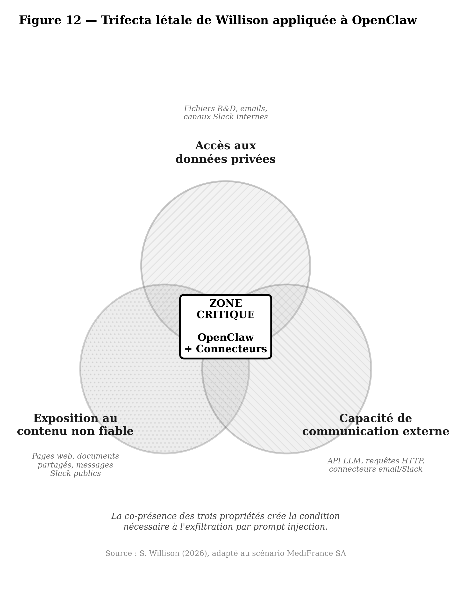

# 🔒 Operation OpenClaw — Kill Chain Analysis of an AI Agent-Driven Cyberattack

[](https://creativecommons.org/licenses/by-nc-sa/4.0/)
[]()
[]()

> **⚠️ Ce dépôt est un travail de recherche académique en cours. Les documents sont mis à jour régulièrement. Consultez le [CHANGELOG](CHANGELOG.md) pour les corrections.**

---

## 🇫🇷 Résumé

Ce dépôt contient l'analyse complète d'une **cyberattaque fictive multi-phases exploitant un agent IA autonome** (OpenClaw) contre une entreprise pharmaceutique (MediFrance SA). L'étude modélise une kill chain agentique complète — de la reconnaissance OSINT augmentée par LLM jusqu'au déploiement d'un rançongiciel et à la double extorsion — en s'appuyant exclusivement sur des vulnérabilités, outils et techniques documentés dans la littérature publique (février 2026).

**Contribution principale** : démontrer que la convergence entre agents IA autonomes, compromission supply chain et techniques d'attaque classiques (AD, ransomware) crée une surface d'attaque qualitativement nouvelle qui nécessite un modèle de défense en profondeur spécifique.

## 🇬🇧 Abstract

This repository contains the full analysis of a **fictional multi-phase cyberattack leveraging an autonomous AI agent** (OpenClaw) against a pharmaceutical company (MediFrance SA). The study models a complete agentic kill chain — from LLM-augmented OSINT reconnaissance to ransomware deployment and double extortion — relying exclusively on vulnerabilities, tools and techniques documented in the public literature (February 2026).

**Key contribution**: demonstrating that the convergence of autonomous AI agents, supply chain compromise, and classical attack techniques (AD, ransomware) creates a qualitatively new attack surface requiring a specific defense-in-depth model.

---

## 📁 Structure du dépôt / Repository Structure

```
openclaw-killchain-analysis/
│
├── README.md                              ← this file
├── CHANGELOG.md                           ← corrections & version history
├── LICENSE                                ← CC BY-NC-SA 4.0
│
├── NOTE_ACADEMIQUE.md                     ← Note de synthèse (8-12 pages)
│                                             Academic summary note
│
├── phases/                                ← Analyses détaillées par phase
│   ├── Phase1_Reconnaissance.pdf             Detailed analysis per phase
│   ├── Phase2_Armement.pdf
│   ├── Phase3_Livraison_Exploitation.pdf
│   ├── Phase4_Mouvement_Lateral.pdf
│   └── Phase5_Impact.pdf
│
├── figures/                               ← Figures académiques (FR + EN)
│   ├── fig12_trifecta_fr.png                Academic figures
│   ├── fig12_trifecta_en.png
│   ├── fig20_defense_killchain.png
│   ├── fig21_timeline_fr.png
│   ├── fig21_timeline_en.png
│   ├── fig22_mitre_heatmap_fr.png
│   ├── fig22_mitre_heatmap_en.png
│   └── ...
│
└── scripts/                               ← Scripts de génération des figures
    └── gen_figures.py                        (numérotation paramétrable)
```

## 📖 Guide de lecture / Reading Guide

| Temps disponible | Document recommandé |
|-----------------|-------------------|
| **5 minutes** | Ce README + les figures |
| **20 minutes** | [Note académique de synthèse](NOTE_ACADEMIQUE.md) |
| **1 heure** | Note + une phase au choix |
| **Étude complète** | Les 5 phases dans l'ordre |

## 🗺️ Les 5 Phases / The 5 Phases

| Phase | Titre | Période | Pages | Résumé |
|-------|-------|---------|-------|--------|
| **1** | Reconnaissance | J−30 → J−15 | ~25 p. | OSINT augmenté par LLM, graphe social, 40 000+ agents OpenClaw exposés via Shodan |
| **2** | Armement | J−15 → J−7 | ~25 p. | Skill piégée ClawHub, ransomware PromptLock (Go), payloads d'injection de prompt, deepfake audio |
| **3** | Livraison & Exploitation | J−7 → J | ~25 p. | 3 vecteurs simultanés : supply chain skill, infostealer (vol tokens Hudson Rock), CVE-2024-55591 VPN |
| **4** | Mouvement latéral | J → J+5 | ~30 p. | Agent fantôme, prompt injection via Slack, DCSync → Golden Ticket, PoisonGPT chatbot |
| **5** | Actions sur l'objectif | J+5 → J+6 | ~25 p. | Exfiltration R&D complète, PromptLock déployé, double extorsion, impact estimé 7,5 M€ |

## 🛡️ Modèle de Défense en Profondeur / Defense-in-Depth Model

L'étude propose un modèle défensif en **5 couches** :

| Couche | Principe | Contrôles clés |
|--------|----------|---------------|
| **C1** — Gouvernance de l'agent | Le LLM est un conseiller, pas un exécuteur | Allowlist d'outils, sandbox, human-in-the-loop |
| **C2** — Contrôle des entrées | Tout contenu ingéré est non fiable | Séparation données/instructions, besoin d'en connaître |
| **C3** — Contrôle des sorties | Un flux HTTPS légitime peut masquer un abus | Proxy egress, DLP, allowlist de destinations |
| **C4** — Réduction de l'impact | L'agent compromis ne doit pas hériter des droits du SI | Segmentation, sauvegardes 3-2-1-1-0, protection AD |
| **C5** — Hygiène fondamentale | Les contrôles agentiques ne remplacent pas les fondamentaux | Patch management, MFA, exposition minimale |

**Enseignement central** : les couches C4–C5 (fondamentaux) auraient bloqué la majorité de la kill chain. Les couches C1–C3 (spécifiques IA) complètent mais ne remplacent pas cette base.

## 📊 Figures clés / Key Figures

<table>
<tr>
<td><br/><em>Fig. 12 — Trifecta létale de Willison</em></td>
<td><br/><em>Fig. 22 — Heatmap MITRE ATT&CK</em></td>
</tr>
</table>

## ⚖️ Avertissement / Disclaimer

> **Ce travail est une analyse académique basée sur un scénario entièrement fictif.** MediFrance SA n'existe pas. Aucune attaque réelle n'a été conduite. Toutes les vulnérabilités et techniques décrites sont documentées dans la littérature publique. L'objectif est exclusivement défensif : identifier les risques liés aux agents IA autonomes pour améliorer les postures de sécurité.

> **This work is an academic analysis based on an entirely fictional scenario.** MediFrance SA does not exist. No actual attack was conducted. All vulnerabilities and techniques described are documented in the public literature. The purpose is exclusively defensive: identifying risks associated with autonomous AI agents to improve security postures.

## 📄 Citation

```bibtex
@techreport{pizzi2026openclaw,
  title     = {Opération OpenClaw : Modélisation d'une Kill Chain Agentique Contre une Infrastructure d'Entreprise},
  author    = {Pizzi, Fabrice},
  year      = {2026},
  month     = {February},
  institution = {Université Paris Sorbonne},
  type      = {Technical Report},
  url       = {https://github.com/mo0ogly/openclaw-killchain-analysis}
}
```

## 📬 Contact

- **Auteur** : Fabrice Pizzi
- **GitHub** : [@mo0ogly](https://github.com/mo0ogly)
- **LinkedIn** : [à compléter]

## 📜 Licence

Ce travail est publié sous licence [Creative Commons Attribution-NonCommercial-ShareAlike 4.0 International (CC BY-NC-SA 4.0)](https://creativecommons.org/licenses/by-nc-sa/4.0/).

Vous êtes libre de partager et adapter ce travail à condition de créditer l'auteur, de ne pas en faire un usage commercial, et de partager les adaptations sous la même licence.
