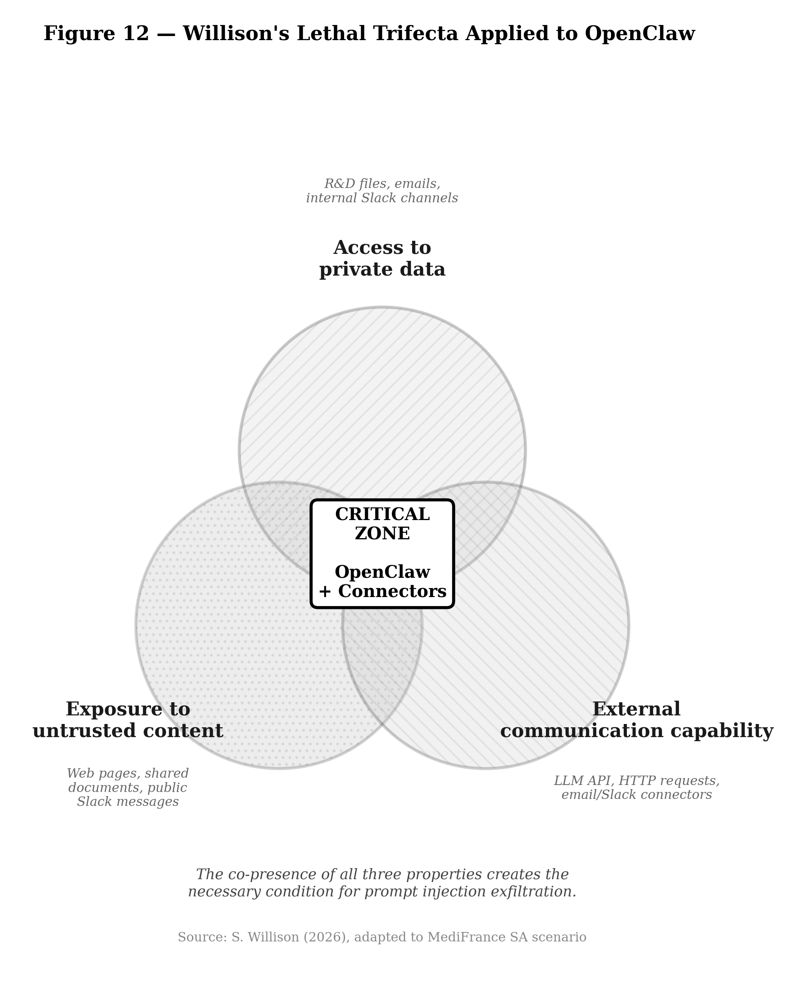

# 🔒 Operation OpenClaw — Kill Chain Analysis of an AI Agent-Driven Cyberattack

[](https://creativecommons.org/licenses/by-nc-sa/4.0/)
[]()
[]()

> **⚠️ This repository is an active research project. Documents are updated regularly. See the [CHANGELOG](CHANGELOG.md) for corrections.**

---

## Abstract

This repository presents a **comprehensive threat model of a fictional multi-phase cyberattack** exploiting an autonomous AI coding agent (OpenClaw) as both attack vector and force multiplier against a mid-size pharmaceutical company. The study models a complete **agentic kill chain spanning 36 days**, from LLM-augmented OSINT reconnaissance through supply chain compromise, lateral movement via AI agent impersonation, to ransomware deployment and double extortion.

All vulnerabilities, tools and techniques are documented in the public literature (February 2026).

**Key findings:**
- **13 of 14 MITRE ATT&CK Enterprise tactics** are covered across the five phases
- **Phase 4 (lateral movement) — not Phase 5 (ransomware)** — is the technical center of gravity
- A compromised AI agent acts with **system permissions, automation speed, and natural language adaptability**
- **Foundational controls** (patching, MFA, segmentation, immutable backups) would have disrupted the majority of the kill chain
- AI-specific controls (tool allowlists, sandboxing, egress monitoring) are **complementary but not substitute** protection

A **five-layer defense-in-depth model** specific to agentic AI threats is proposed.

---

<details>
<summary>🇫🇷 <strong>Résumé en français</strong></summary>

Ce dépôt présente la modélisation complète d'une cyberattaque fictive multi-phases exploitant un agent IA de codage autonome (OpenClaw) comme vecteur d'attaque et multiplicateur de force contre une entreprise pharmaceutique. L'étude couvre une kill chain agentique de 36 jours, de la reconnaissance OSINT augmentée par LLM jusqu'au déploiement d'un rançongiciel et à la double extorsion. Un modèle de défense en profondeur en cinq couches spécifique aux menaces agentiques est proposé.

📄 La note de synthèse en français est disponible : [NOTE_ACADEMIQUE.md](NOTE_ACADEMIQUE.md)

</details>

---

## 📁 Repository Structure

```
openclaw-killchain-analysis/
│
├── README.md                              ← this file
├── CHANGELOG.md                           ← corrections & version history
├── LICENSE                                ← CC BY-NC-SA 4.0
│
├── ACADEMIC_NOTE.md                       ← Summary note (EN, ~10 pages)
├── NOTE_ACADEMIQUE.md                     ← Note de synthèse (FR, ~10 pages)
│
├── phases/                                ← Detailed phase analyses
│   ├── Phase1_Reconnaissance.pdf             ✅ available (FR)
│   ├── Phase1_Reconnaissance_en.pdf          ✅ available (EN)
│   ├── Phase2_Weaponization.pdf              ✅ available (FR)
│   ├── Phase2_Weaponization_EN.pdf           ✅ available (EN)
│   ├── Phase3_Installation_Exécution.pdf     ✅ available (FR)
│   ├── Phase3_Installation_Execution_EN.pdf  ✅ available (EN)
│   ├── Phase4_Mouvement_Latéral_Persistance.pdf     ✅ available (FR)
│   ├── Phase4_Lateral_Movement_Persistence_EN.pdf   ✅ available (EN)
│   └── Phase5_Impact.pdf                     ⏳ coming soon
│
├── figures/                               ← Academic figures (EN + FR)
│   ├── fig12_trifecta_en.png
│   ├── fig22_mitre_heatmap_en.png
│   └── ...
│
└── scripts/                               ← Figure generation scripts
    └── gen_figures.py
```

## 📖 Reading Guide

| Time available | Start here |
|---------------|-----------|
| **5 min** | This README + key figures below |
| **20 min** | [Academic Note (EN)](ACADEMIC_NOTE.md) or [Note académique (FR)](NOTE_ACADEMIQUE.md) |
| **1 hour** | Summary note + one phase of your choice |
| **Full study** | All 5 phases in order |

## 🗺️ The 5 Phases

| Phase | Title | Timeline | Key Findings |
|-------|-------|----------|-------------|
| **1** | Reconnaissance | D−30 → D−15 | LLM-augmented OSINT, social graph reconstruction, 40,000+ exposed OpenClaw agents via Shodan |
| **2** | Weaponization | D−15 → D−7 | Malicious ClawHub skill, PromptLock ransomware (Go), prompt injection payloads, audio deepfake |
| **3** | Delivery & Exploitation | D−7 → D | 3 simultaneous vectors: skill supply chain, infostealer (token theft per Hudson Rock), CVE-2024-55591 VPN |
| **4** | Lateral Movement | D → D+5 | Shadow agent, Slack prompt injection, DCSync → Golden Ticket, PoisonGPT chatbot poisoning |
| **5** | Actions on Objectives | D+5 → D+6 | Full R&D exfiltration, PromptLock deployed, double extortion, €2.5M ransom / €7.5M est. total impact |

## 🛡️ Defense-in-Depth Model

| Layer | Principle | Key Controls |
|-------|----------|-------------|
| **C1** — Agent Governance | The LLM is an advisor, not an executor | Tool allowlists, sandbox, human-in-the-loop |
| **C2** — Input Control | All ingested content is untrusted | Data/instruction separation, need-to-know access |
| **C3** — Output Control | Legitimate HTTPS can mask logical abuse | Egress proxy by app identity, DLP, destination allowlists |
| **C4** — Impact Reduction | Compromised agent must not inherit SI-wide permissions | Segmentation, 3-2-1-1-0 backups, AD hardening |
| **C5** — Basic Hygiene | Agentic controls don't replace fundamentals | Accelerated patching, MFA, minimal exposure |

**Core insight**: Layers C4–C5 (fundamentals) would have disrupted the majority of the kill chain. Layers C1–C3 (AI-specific) are complementary, not substitute.

## 📊 Key Figures

<table>
<tr>
<td><br/><em>Fig. 12 — Willison's Lethal Trifecta</em></td>
<td><br/><em>Fig. 22 — MITRE ATT&CK Density Matrix</em></td>
</tr>
</table>

## ⚖️ Disclaimer

> **This work is an academic analysis based on an entirely fictional scenario.** MediFrance SA does not exist. No actual attack was conducted. All vulnerabilities and techniques described are documented in the public literature. The purpose is exclusively defensive: identifying risks associated with autonomous AI agents to improve security postures.

## 📄 Citation

```bibtex
@techreport{pizzi2026openclaw,
  title     = {Operation OpenClaw: Modeling an Agentic Kill Chain Against Enterprise Infrastructure},
  author    = {Pizzi, Fabrice},
  year      = {2026},
  month     = {February},
  institution = {Université Paris Sorbonne},
  type      = {Technical Report},
  url       = {https://github.com/mo0ogly/openclaw-killchain-analysis}
}
```

## 📬 Contact

- **Author**: Fabrice Pizzi
- **GitHub**: [@mo0ogly](https://github.com/mo0ogly)
- **LinkedIn**:  https://www.linkedin.com/in/fpizzi/

## 📜 License

[Creative Commons Attribution-NonCommercial-ShareAlike 4.0 International (CC BY-NC-SA 4.0)](https://creativecommons.org/licenses/by-nc-sa/4.0/)
